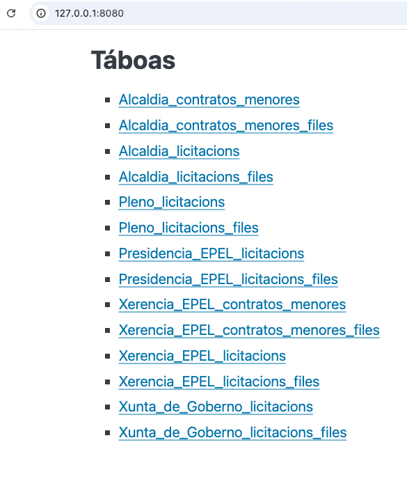
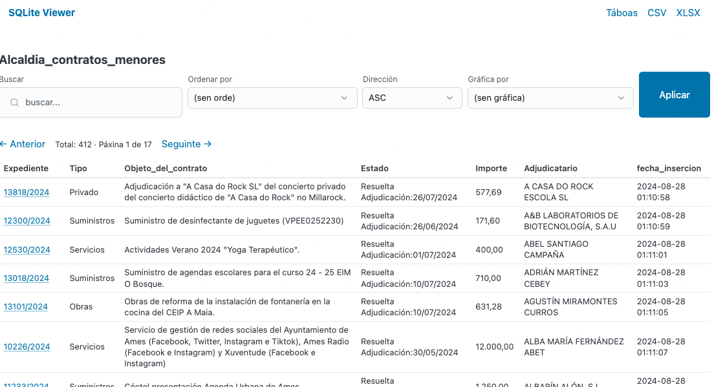
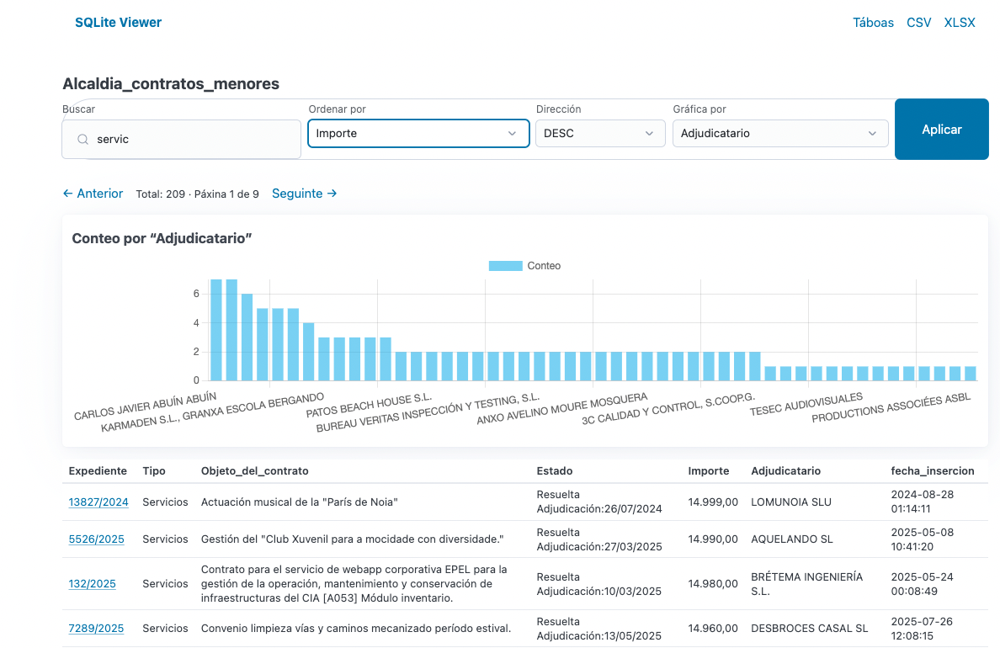
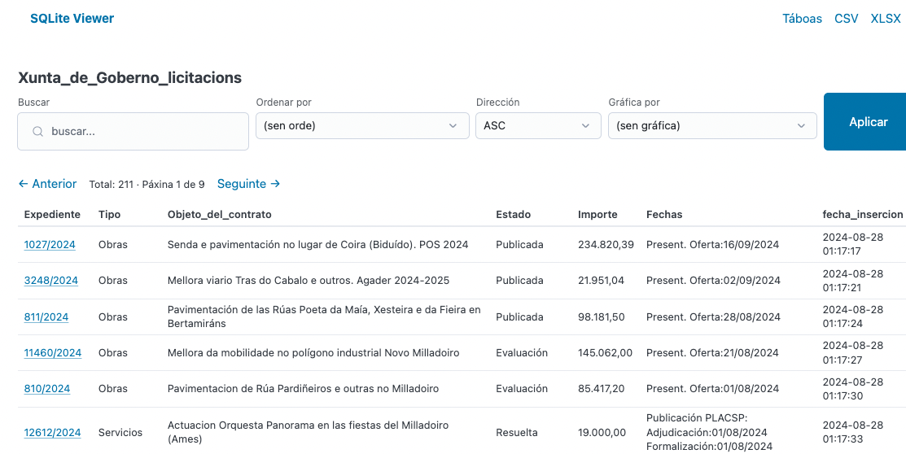
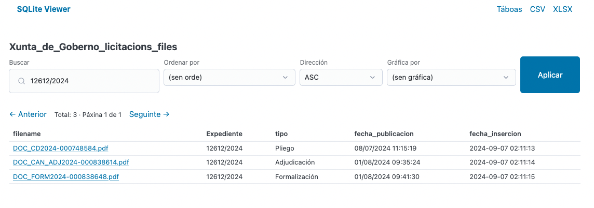
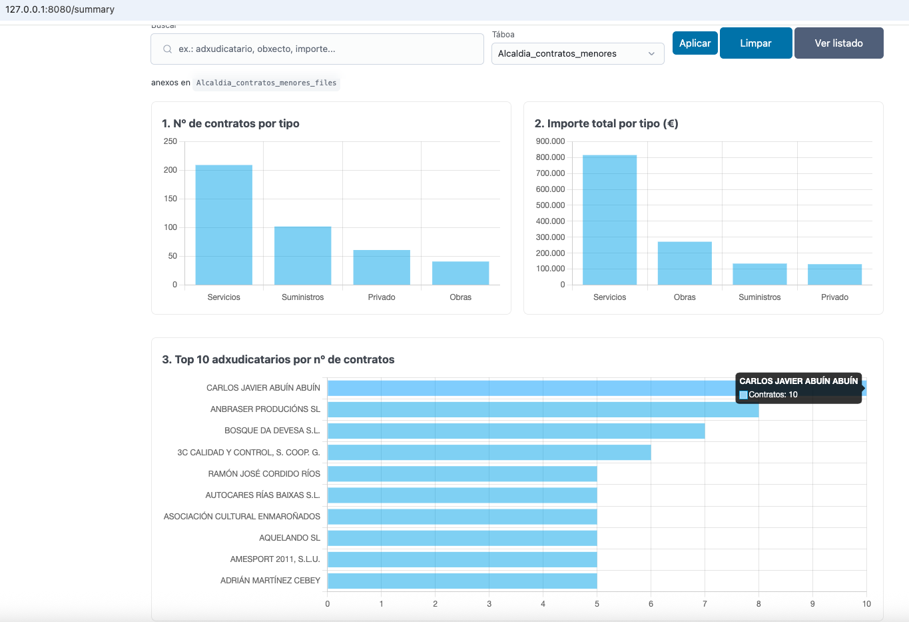
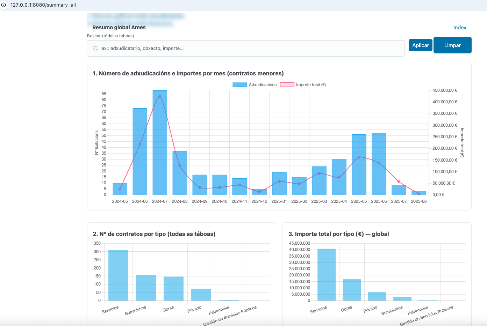
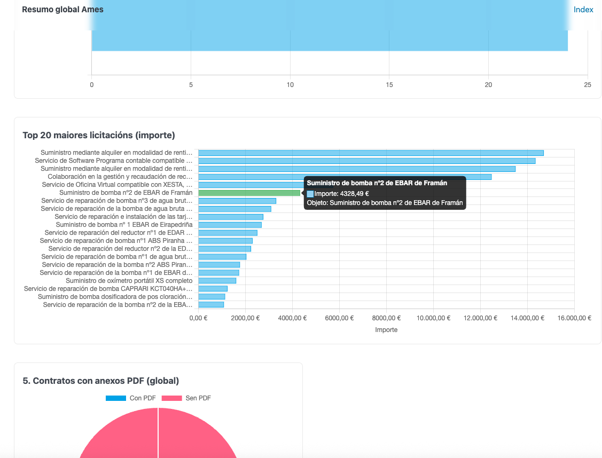

# licitaberto

Licitacións de concelhos da Plataforma de Contratación do Sector Público: [https://contrataciondelestado.es/](https://contrataciondelestado.es/)

## Que

Frontend de licitacións dun concelho/s dado/s para revisar visual e rapidamente as contratacións e licitacións dadas de alta na Plataforma de Contratación do Sector Público.

## Como

O proxecto ten 2 componhentes:

- Scrapper: réplica e afinado de [https://github.com/alexandregz/plataforma_contratacion_estado_scrapper](https://github.com/alexandregz/plataforma_contratacion_estado_scrapper)
- Front-end: acceso aos datos parseados polo `scrapper` de xeito cómodo.

## Requerimentos

- [`bun`](https://bun.com/) (ou `node`)
- [`puppeteer`](https://pptr.dev/)
- `sqlite`
- `PHP`

## Instalación

Pódese empregar fisicamente ou empregar `Docker`(recomendado).

## Uso

```bash
alex@vosjod:~/Development/licitaberto (main)$ go run . --db ../plataforma_contratacion_estado_scrapper/ames.db --mode web --addr 0.0.0.0:8080
2025/10/05 02:10:20 concello: Ames
2025/10/05 02:10:20 Web UI en http://0.0.0.0:8080
2025/10/05 02:10:20 PDFs en ../plataforma_contratacion_estado_scrapper/PDF/ames
```

## Uso TUI

ToDo, sen uso efectivo actualmente!.

```bash
alex@vosjod:~/Development/licitaberto $ go run . --db ../plataforma_contratacion_estado_scrapper/san_cibrao_das_vinhas.db --mode tui
``` 


## Docker

ToDo


## Screenshots















